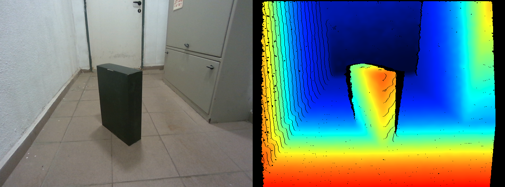
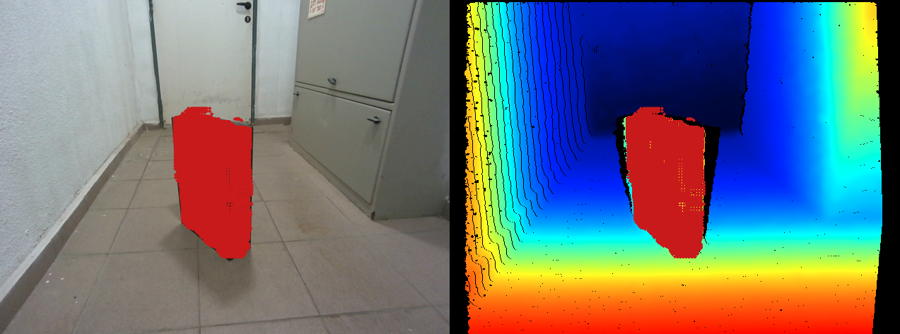
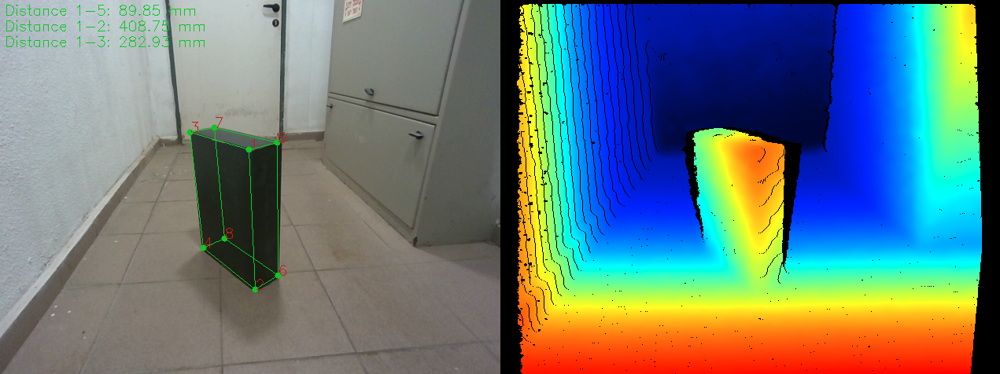

# RealSense

## Overview

An experimental tool whos purpose is to calculate any cuboid-like object
dimensions. This repo focuses on the use of RealSense Stereo cameras:
D435i, D455 and Lidar L515.

<p align="center">

</p>
<h6 align="center">Object RGB and depth map</h6>

<p align="center">

</p>
<h6 align="center">Painting the object with the mouse</h6>

<p align="center">

</p>
<h6 align="center">Calculating the box dimensions</h6>

### Performance
#### Measurements
Calculated Dimensions [mm] | Real Dimensions [mm] | Error (%)
:---:|:---:|:---:
89.8 | 95 | 5.5
408.7 | 415 | 1.5
282.9 | 290 | 2.4

#### Repetitiveness
The algorithm right now is not robust enough to handle changes in
distances, human selecting variance (different operators) etc

## Usage
Just run 
```python
python calculate_box.py
```
with realsense camera connected (D435i, D455, L515)
Hold mouse button to paint the box, press [C] to calculate dimensions, [N] to reset session 
[SPACE] to freeze frame, [Q] to quit.

## References
Based on RealSense SDK:
https://github.com/IntelRealSense/librealsense

With python wrapper:
https://github.com/IntelRealSense/librealsense/tree/master/wrappers/python

pip3 install pyrealsense2

pyRANSAC is used for 3 orthogonal planes RANSAC
https://github.com/leomariga/pyRANSAC-3D

pip3 install pyransac3d

Open3D lib for debugging and visualing:
http://www.open3d.org/

pip3 install open3d

## Algo Review

1. Initialize Camera:
   1. Init the camera and parameter - `init`
   2. Align frames - `run()` function
   3. Run filters: Spatial, Temporal, Fill holes `run()` function
2. Select Points:
   1. Hold mouse to 'paint' the whole object - `click()` function
   2. The pixels with its depth information are stored in a global buffer
   3. We calculate the 3d coordinates using `get_3d_coords()` and store to a 3d buffer
3. Press [C] to begin calculating
   1. Using RANSAC we find all the points in the buffer that fit 
   the best to 3 orthogonal planes (Min 6 points, works best with n~10e4 points).
   We also find the 3 orthogonal plane equations (Aix +Biy +Ciz +D = 0)
   2. We project all the inliers on the normal vector of every plane
   (Dot product of the inliers matrix with the plane's normal equation
   (A,B,C)) - We use the `pyransac3d.Cuboid()` class for that.
   3. We then find where is the farthest projection from the original plane,
   this is where the opposite plane will lay - Aix +Biy +ciz +D'(max_projection) = 0.
   (Inorder to make the bounding box tight- We use the 99.5% percentile point) -
   `add_opposite_plane()`
   4. We then find all the 8 points that intersect our 6 planes using `calc_8plane_inter()`
   and `calc_3plane_inter()`
   5. Lastly we calculate the distance between intersection points using `cal_3d_distance()` 
4. We use `visuals()` function to visualize the bounding box, The painted box at the
painting stage and more visuals.
5. Helper functions: 
- `get_smart_dist(p1, p2)` - calculate smart 3d distance based on
neighbourhood pixels
- `get_2d_coords(P)` - get pixels (u, v) from 3d coordinates (X, Y, Z)
- `get_3d_coords(p)` - get 3d coordinates (X, Y, Z) from pixels (u, v) and depth value
- `calc_plane(points)` - Calculates plane using least squares
- `calc_plane_ransac` - Calculates plane using `calc_plane` and RANSAC
- `calc_2plane_inter(plane1, plane2)` - Calculates intersection of two planes (Vector)
